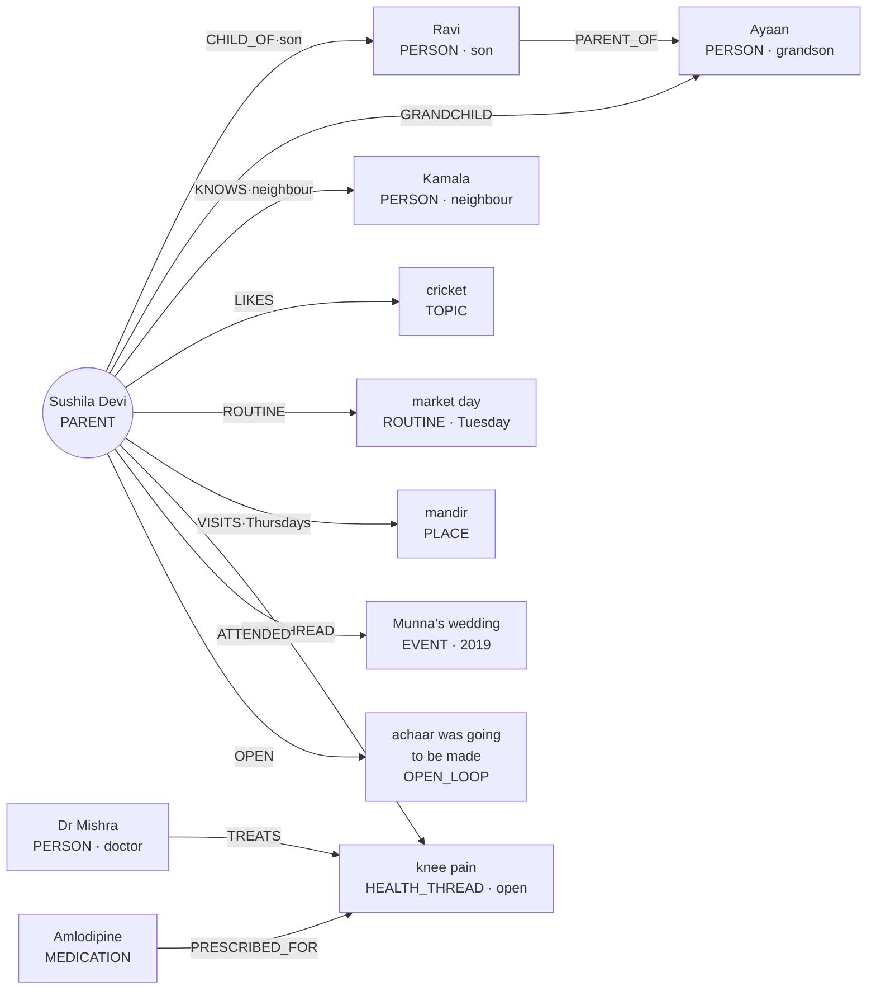

# Sahara — long-term memory and the per-parent knowledge graph

*Design framework, 10 September 2026. Companion to `VISION.md` (§2.4 summarises this) and
`SAHARA_PROJECT.md`. Written after the five-track debate, which named persistent memory the single
highest-leverage feature in the product and the only durable moat.*

---

## 1. Why this exists

Gemini Live is a commodity; anyone can rent it next week. Two years of *knowing Sushila Devi* is not.
Memory is what turns a wellness checklist into a relationship, and the relationship is what moves all
three pilot metrics at once:

- **Answer rate** — she picks up because the voice remembers her.
- **Call length** — a callback to yesterday's thread opens a conversation instead of closing a form.
- **Unprompted-topic share** — the metric *is* memory. People volunteer things to someone who
  remembered the last thing.

And on the paying side, memory is what upgrades the child's WhatsApp from a status report ("all fine")
into evidence of a life: *"she laughed telling me the pickle came out too spicy."*

Every other engagement feature in the roadmap — festival greetings, reminiscence, the weekly digest, the
month-3 family report, the story archive — is a **consumer of this one store**. Build it once and the
rest becomes prompt work.

## 2. Three rules that shape everything

**Facts, never transcripts.** Transcripts are deleted at `SAHARA_RETENTION_DAYS` (30). Memory must not
quietly become a shadow transcript archive that outlives its own retention policy. Every node in the
graph is a short, structured fact written by a *tool call*, never by parsing free text after the fact —
this extends the existing logged decision ("facts through tools") rather than inventing a new path.

**No vector RAG over conversations.** Embedding transcripts would recreate exactly the archive the rule
above forbids, and it makes hallucinated memory possible. A wrong memory is worse than no memory:
misremembering a dead spouse's name or a grandchild's exam is trust-ending, and trust is the founding
rule. Embeddings have one narrow legitimate use here — entity resolution (§6) — and even that starts as
string normalisation.

**The parent owns their memory.** It is disclosed at consent ("Sahara remembers what you tell it, so
calls feel familiar"), it is correctable, it is deletable on request, and it is exportable. Sensitive
nodes are never volunteered. Safety facts always escalate; feelings travel to the child only with the
parent's in-call assent.

## 3. The graph

One graph per parent, hard-scoped by `parent_id`. Nothing crosses families, ever.



**Node kinds.** `PERSON`, `PLACE`, `TOPIC` (preference or interest), `ROUTINE`, `HEALTH_THREAD`,
`MEDICATION`, `EVENT`, `ORGANISATION` (bank, hospital, pension office), `OPEN_LOOP`.

**Edge kinds.** `CHILD_OF`, `PARENT_OF`, `GRANDCHILD`, `SPOUSE_OF`, `KNOWS`, `LIKES`, `DISLIKES`,
`ROUTINE`, `VISITS`, `HAS_THREAD`, `TREATS`, `PRESCRIBED_FOR`, `ATTENDED`, `OPEN`, `MENTIONED_IN`,
and `SAME_AS?` for unresolved duplicate candidates (§6).
Edges carry a free `label` for the kinship or cadence detail (`son`, `neighbour`, `Thursdays`).

**Every node and edge carries:**

| Field | Purpose |
|---|---|
| `parent_id` | Hard scope. No query ever crosses it |
| `confidence` 0–1 | Model-written facts start ~0.6; parent-confirmed 0.9; child-corrected 1.0 |
| `source_call_id`, `first_seen`, `last_confirmed` | Provenance, and the input to decay |
| `sensitivity` | `normal` · `sensitive` (mood, family conflict, money worry) · `never_volunteer` |
| `status` | `active` · `superseded` · `deleted` (soft, so corrections are auditable) |
| `corrected_by` | `model` · `parent` · `child` — pinned facts outrank inferred ones |
| `label_native`, `label_key` | The name as spoken (Devanagari etc.) and a normalised match key |

## 4. Write path — tools, not parsing

Extend `CHECKIN_TOOLS` alongside the existing `log_observation`. Ergonomics matter more than elegance:
the model calls these mid-conversation, so each must be obvious and cheap.

```
remember_person(name, relation, detail?)       # "Ayaan is Ravi's son, in 5th standard"
remember_fact(kind, subject, detail,           # kind: preference|routine|place|event|organisation
              sensitivity?)
open_loop(topic, expect_by?)                   # "going to make achaar today"
close_loop(topic, outcome)                     # asked about it, got an answer
correct_memory(subject, correction)            # parent says we had it wrong
forget(subject, reason)                        # "don't remember that" — parent-initiated
```

`log_observation` stays exactly as it is and keeps feeding the call summary. Two deterministic
fan-outs derive from it server-side — these are tool writes, not transcript parsing: a `health`
observation opens or touches a `HEALTH_THREAD` (symptoms become trackable across days), and a `need`
observation opens an `OPEN_LOOP` (tomorrow's call follows it up). The first real pilot call proved the
need for this: the model logged "wants to see a doctor" as an observation but called no memory tool.

**Never** write memory from a post-call parse of the transcript. If the model did not think it worth a
tool call, it is not a fact.

## 5. Read path — a briefing, not a dump

The failure mode of every memory system is stuffing everything into the prompt. Before each call, compile
a **~300-token briefing** and nothing more:

1. **Identity** — who she is, language, household, who Ravi is.
2. **Three to five salient facts**, chosen by score, not recency alone.
3. **Exactly one open loop** to call back, scripted into the opening.
4. **Today's calendar** — festival, birthday, appointment, anniversary.
5. **Open health threads** with last-mentioned dates.
6. **A do-not-volunteer list** — sensitive nodes the model may respond to but must never raise.

```
salience = w_recency·decay(last_confirmed)
         + w_confidence·confidence
         + w_affect·emotional_weight
         + w_pinned·(corrected_by == "child")
         − w_fatigue·times_used_recently
```

The fatigue term matters: a fact used in the last three calls should yield to a fresher one, or Sahara
becomes the relative who tells the same story every visit.

**One callback per call.** Not four. "कल आप अचार बनाने वाली थीं — बना?" is warmth; a recitation of
everything we know is surveillance.

## 6. Entity resolution

"Ayaan", "my grandson", "the little one", and a misheard "Aayan" must converge on one node — and must
never merge wrongly.

- Match within `parent_id` only, on `label_key` (lowercased, unaccented, common Indic spelling variants
  folded) plus node kind plus relation.
- A confident match refreshes `last_confirmed` and raises confidence.
- An ambiguous match creates a **candidate** node linked `SAME_AS?` and surfaces it in the operator desk
  for the child to confirm or split. Silent merging is forbidden — merging two grandchildren into one is
  the kind of error that ends trust.
- Phonetic matching before embeddings; embeddings only if string and phonetic matching demonstrably fail,
  and scoped to node labels, never to conversation text.

## 7. Decay, correction, forgetting

Nothing is hard-deleted by the system; facts fade in *salience* while staying queryable. A fact
unconfirmed for 90 days with confidence below 0.7 drops out of briefings. Re-mention refreshes it.

Corrections supersede rather than overwrite (`status = superseded`), so "she says her knee is fine now"
does not erase the history of the thread — which is precisely the longitudinal record the pilot exists to
build.

`forget()` is real deletion, parent-initiated, and it cascades to edges. It is offered in-call whenever
the parent signals discomfort, and it is the DPDP erasure right in practice.

## 8. Storage — no graph database

`MemoryNode` and `MemoryEdge` as two SQLModel tables in the existing SQLite → Cloud SQL path. At the
realistic scale — a few hundred nodes per parent, tens of thousands of parents — graph traversal is two
indexed joins. Adding Neo4j for twenty parents would be theatre, and it would break the single-process
Cloud Run deployment the pilot depends on. Revisit only if multi-hop queries over shared structure ever
become a product feature, which they should not: this graph is deliberately per-parent and shallow.

## 9. What the child sees

The graph is the substrate for the artifacts that drive renewal:

- **Better summaries** — one health fact plus one human moment, drawn from nodes touched today.
- **A correctable memory view** in the desk: the child fixes a name, pins what matters, deletes what
  shouldn't be there. Child corrections carry the highest confidence.
- **The month-3 family report** — stories collected, threads tracked, festivals kept.
- **The export** — on cancellation, the family keeps the graph. This is both the ethical answer to
  "what happens when the service stops" and an honest reason to stay.

## 10. Phasing

| Phase | Memory work | Gate |
|---|---|---|
| **Pilot** (weeks 1–8) — **built**, see `sahara/memory.py` | `MemoryNode`/`MemoryEdge` tables; `remember_person`, `remember_fact`, `open_loop`, `close_loop`; briefing compiler with one callback; seed the graph from the onboarding notes | Callback appears in the call and lands in the summary |
| **Phase 2** (months 3–6) | Entity resolution with the candidate queue; decay and fatigue scoring; correction and `forget` tools; child-facing memory view in the desk; festival and birthday nodes | Child corrects a fact and it sticks |
| **Phase 3** (scale) | Health-thread analytics across time; story archive and family report generated from the graph; export on cancellation; phonetic/embedding resolution only if measured to be needed | Longitudinal threads demonstrably surface something a human missed |

## 11. Explicitly out of scope

- **Vector search over transcripts** — recreates the archive DPDP retention forbids.
- **Cross-family or population-level graphs** — a different product with a different consent basis.
- **Inferred psychological profiles** — the graph records what was said, never what it implies about
  personality or diagnosis. Same line as the CDSCO rule: observations, never inferences.
- **Memory the parent cannot see or erase** — if she would be unsettled to learn we kept it, we do not
  keep it.
