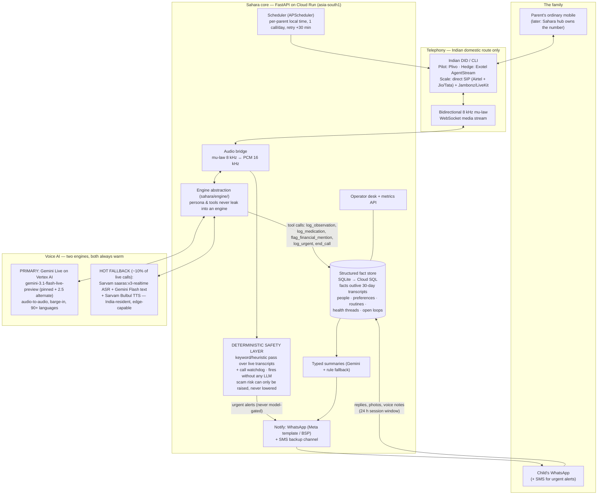

# Sahara — Vision & Phased Roadmap

*Synthesized 10 September 2026 from a five-agent structured debate: (1) GenAI platform — Google vs AWS vs
other providers; (2) telephony stack for India; (3) health & care features; (4) safety & money-guardian
features; (5) companionship & family-experience features. Companion to `SAHARA_PROJECT.md`, which holds
the research record; this file holds the forward plan.*

---

## 1. North star

**A voice the parent looks forward to every morning, and evidence the child gladly pays for every month.**

Two loops must close simultaneously:

- **Parent loop** (answer rate, call length, unprompted-topic share): the parent answers tomorrow because
  today's call felt like *being known*.
- **Child loop** (payment, renewal at month 4): the child renews because they got at least one real catch
  and recurring, visible evidence the parent *likes* the call. A summary that reads "all fine" 120 days in
  a row is a churn machine.

Founding rule, unchanged: the parent's trust. Never deceive the parent; escalate early and loudly; the
emergency path must not depend on any model or vendor.

Three governing insights from the debate, which shape every ranking below:

1. **8 kHz telephony is a terrible sensor but a fantastic interviewer.** Features that use the call as a
   structured conversation (asking, remembering, comparing across days) are ready now. Features that use
   it as a passive biosensor (acoustic depression/breathlessness detection) are not — and claiming
   otherwise is the fastest route to the missed-emergency trust death.
2. **The digital-arrest scam is not a call-blocking problem.** It runs for days under an isolation
   instruction and extracts money by bank transfer. Screening catches the first contact; the *daily call
   breaks the isolation*; money-rail setup catches the extraction. Sahara can layer all three — no free
   caller-ID app can.
3. **Memory is the moat.** Gemini Live is a commodity; two years of "knows Sushila Devi" is not. Every
   high-value engagement feature is a consumer of one structured fact store.

---

## 2. Software stack

### 2.1 Target architecture (pilot → scale)

Inbound screening path (unchanged shape): unknown caller → conditional call forwarding → Sahara DID →
screener persona → connect / take message / block → child told, transcript kept as evidence.

### 2.2 Stack decision — voice AI (agent 1's verdict)

A two-horse race between Gemini Live and Sarvam; **run both**, which the engine abstraction already
anticipates. The decision is not "which vendor" but "which is primary at which phase."

| Decision | Verdict | Why |
|---|---|---|
| Primary engine | **Gemini Live**, migrated from AI Studio key to **Vertex AI before the first paid month** | Only native audio-to-audio model covering the whole Indic roadmap (90+ languages); barge-in and paralinguistics free; ~₹4 per 3-min call; Vertex adds SLA, DPA, audit logs, raisable Live-session quotas |
| Hot fallback | **Sarvam cascade** (saaras:v3-realtime ASR + Gemini Flash *text* for tool reliability + Bulbul TTS), exercised on ~10% of real calls | A fallback that only runs when the primary is down is a fallback that fails; Sarvam is the DPDP/residency trump card ("her voice never leaves India") and the only architecture with an edge path for the hub |
| Safety layer | Emergency and scam escalation fire from the **deterministic layer** (keyword pass in the bridge + call watchdog), never solely from a model tool-call; alerts go WhatsApp **and** SMS | No vendor scores 5/5 on safety-critical reliability; the design goal is that vendor choice cannot break the emergency path |
| Rejected | AWS Nova 2 Sonic (Hindi-only among Indian languages — disqualifying for a mother-tongue product); OpenAI Realtime (cost ₹16–60/call + residency; revisit mini for a screener A/B only); ElevenLabs (₹21–32/call, Indic is its weak suit; only the disclosed familiar-voice TTS if ever); Azure (partial residency, third cloud); Amazon Connect (wrong abstraction) | |
| Endgame | Self-hosted AI4Bharat (IndicConformer fine-tuned on the pilot's elderly-speech corpus) at the hub phase — the only path to "emergency path works without the cloud" and falling unit costs at scale | Wrong phase today: 6–12 months of infra for a two-person team |

**Re-evaluation triggers:** Nova 3 adds Bengali/Tamil; Gemini Live gets an asia-south1 residency
commitment; Sarvam ships true speech-to-speech (adopt it); Realtime-mini price cut (screener only).

**Pilot double-duty:** score every pilot call's audio against both Gemini and Sarvam transcripts to build
the **elderly/dialectal benchmark set** — the single most valuable artifact for every later platform
decision; nobody else has it.

### 2.3 Stack decision — telephony (agent 2's verdict)

**The reframing fact: Twilio does not do domestic India voice.** Its own guidelines route outbound India
calls from *foreign* numbers only — a 10× cost, an answer-rate poison, and the exact
international-scam-call pattern Sahara warns parents about (and that DoT's spoofed-call filter targets).
The repo's "Twilio or Plivo" symmetry is false in India.

| Stage | Choice | Trigger to move |
|---|---|---|
| Pilot (weeks 1–8) | **Plivo domestic** (₹0.38/min, Indian DID, code already written). **Company registration + GST is the true week-1 blocker** — Plivo rents Indian numbers only to registered entities; start incorporation immediately, not in week 2 | — |
| Pilot hedge (week 3–4) | **Exotel AgentStream adapter** (~1 day against the existing bridge; protocol near-identical): mobile-series CLI A/B on answer rate, second domestic route, strongest DLT/UCC compliance buffer | — |
| Growth (100–5k parents) | **Exotel primary, Plivo secondary** — at this stage a telco AI-spam filter mislabeling Sahara's CLI is the existential risk; Exotel's compliance machinery is worth the ~₹20–30/parent-month premium | Sustained volume + first UCC scare |
| Scale (≥5k parents) | **Direct SIP trunks (Airtel + one of Jio/Tata) into self-hosted Jambonz or LiveKit SIP**, Exotel as overflow. Same operator relationship the hub needs (VoLTE M2M SIMs, elder plan) — start the conversation ~6 months before the hub pilot regardless of cost math | CPaaS bill > ~₹5L/month **and** a voice-infra engineer hired |
| Hub phase | Hub owns the parent's MSISDN via VoLTE; screening becomes native; CPaaS remains for non-hub users. Twilio survives only as a possible NRI-side (child abroad) leg | — |

Telephony is 1.5–3% of revenue on any domestic route — **optimize for answer rate and regulatory
survivability, not paise per minute.**

**Regulatory red flags** (could kill the product; mitigation in place → tracked):

1. **UCC/spam classification of a daily repeated call** (highest risk): recorded consent from the
   *parent* (recipient — the child's consent is not sufficient under TCCCPR), DLT Principal Entity
   registration, one CLI per ~100–200 parents, saved-contact onboarding, Truecaller Verified Business,
   naturally long answered calls.
2. **Designated-series squeeze** (1600 = BFSI-only today): live on ordinary 10-digit numbers as a
   consented subscription service; verify the July 2026 TRAI clarification before scale; operator
   partnership is the durable escape hatch.
3. **Call-forwarding friction**: USSD CCF activation suspended since Apr 2024 — the onboarding visit
   activates CCF via the operator app, per-operator runbooks, weekly forwarding-health test call
   (a first-class pilot metric).
4. **Toll bypass**: never bridge an Indian PSTN call to an international voice leg outside licensed ILD.
   Streaming media to Gemini is processing, not interconnection — fine.
5. **DPDP cross-border + IT Rules 2026**: spoken recording notice and spoken AI disclosure every call
   (including screener answers); 30-day transcript retention; prefer Vertex India serving when offered.

### 2.4 Cross-cutting engineering rules (consolidated from all five agents)

- **Facts outlive transcripts.** The retention split (30-day transcripts, durable structured facts) is
  the quiet architecture win: every Phase 2/3 feature consumes facts, none needs raw audio. Protect the
  boundary.
- **"Said / observed, never is."** Every summary and alert reports observations ("Amma *said*…",
  "Sahara *observed*…"), never diagnoses ("Amma *is*…"). Encoded in the summarize schema, not in vibes.
  This one style rule is most of the CDSCO defense.
- **Every detector ships as a conversation-trigger, not an alarm.** Radar event → "are you alright?"
  call; missed meds → warm question. Sahara's false positives cost a pleasant phone call, not an
  ambulance.
- **Risk verdicts only ratchet up.** Heuristics may raise the model's scam risk, never lower it; the
  WhatsApp scam-checker may raise suspicion, never certify "safe."
- **Escalation asymmetry.** Cheap rungs eager (call the child, stay on the line), expensive rungs
  confirmed (108 ambulance with spoken assent, defined incapacity exception documented in consent).
  Every escalation gets an auditable timeline the child sees afterwards.
- **No triage reassurance, ever.** "It's probably gas" is hard-prohibited with regression tests, like
  the scam-risk ratchet.
- **Sahara never touches money.** Never holds funds, never knows a PIN, never a payment participant.
  The child approves in their own bank's app; Sahara advises, sets up, and watches.
- **No undisclosed synthetic voices; no dark patterns.** Spoken AI disclosure every call. No streaks,
  guilt nudges, or synthetic cliffhangers aimed at the parent. Cancellation triggers a 2–4 week goodbye
  taper, never a hard stop.
- **Parent-controlled disclosure of feelings.** Safety events always escalate (disclosed up front);
  confided feelings travel to the child only with the parent's in-call consent ("yeh main Ravi ko bata
  doon?").

---

## 3. Feature vision by track

### 3.1 Companionship & family experience — *the answer-rate engine*

Highest-leverage single feature in the entire debate: **memory v1 — a structured fact store (not vector
RAG, not a transcript archive) + one open-loop callback per call** ("kal aap achaar banane wali thi —
bana?"). It moves all three parent-side pilot metrics, upgrades the child summary from status report to
relationship evidence, and every later feature (reminiscence, festivals, digests, story archive) is a
consumer of the same store. Runner-up: **grandchildren's real voice notes** spliced into the call — real
audio, zero synthesis risk, reuses the son's-greeting pipeline, and manufactures "answer tomorrow."

Child-side: **WhatsApp is the product surface for all of year one** (no app). Summaries end with a
question ("reply with anything you want Sahara to ask Amma tomorrow") — the reply re-opens the 24-hour
session, feeds the memory store, and makes the child a co-author of the call. Renewal stack: one real
catch → visible evidence the parent wants it → the child's own participation → a month-3 family report
two weeks before the renewal decision.

### 3.2 Health & care — *the trust spine*

The pilot ships **protocol, not sensing**: emergency escalation v1 (two disambiguating questions max →
parallel WhatsApp + voice call to the child → mandatory second contact → conference or 108 with spoken
assent; monthly announced drills; hard-coded no-cloud path), **medication adherence by name**
(conversational, explicitly self-reported, streak alerts — the most likely week-8 "real catch"), and
**symptom streak flags** over daily-asked sleep/appetite/pain/dizziness/falls. Vitals arrive with the
hub (BLE BP cuff trend line in the Sunday digest — the flagship hub-upsell); ABHA and insurance-claim
support are Phase 3 products with Phase 2 groundwork (ABDM sandbox, proxy-consent and IRDAI legal
opinions, 3–5 claims done by hand). Fall *response* (button + protocol) is sold; fall *classification*
(radar) ships late, undersold, as a check-in-call trigger.

### 3.3 Safety & money guardian — *what the child is buying*

Killer feature: **"Sahara answered the scam call so your mother never did"** — the screener-that-answers
plus a WhatsApp alert carrying the scam transcript. Unforgeable proof of value no free caller-ID app can
replicate, and the week-8 gate's "one real catch" on a plate. The silent layer that catches the biggest
losses is the **daily-call financial tripwire**: a standing gentle question about strangers/money, a
`flag_financial_mention` tool, and a cooling-off conference with the child before any large payment —
it works even when the scam call never touched the Sahara number. The money guardian is real today with
zero partnerships: a **UPI Circle concierge** at onboarding (child-approved delegated payments, the
parent's corpus account de-UPI'd). When prevention fails: the **golden-hour playbook** — assemble the
evidence packet, conference the child into the 1930 helpline, run the RBI 3-day limited-liability clock.
Coexist with Truecaller/Google (recommend them); never compete on caller-ID.

---

## 4. Phased roadmap

Phase gates are the spine: each phase ships only what its stack readiness supports, and each phase's
groundwork items exist solely to unblock the next.

### Phase 1 — Pilot (weeks 1–8 · 15–20 parents · one language, one city · no hardware)

**Question answered:** will the parent pick up, and will the child pay?
**Gate to Phase 2 (week 8):** answer rate > 70% · renewals/real ₹1,999 payments · at least one real catch.

| # | Item | Track |
|---|---|---|
| 0 | **Incorporate + GST now** (Plivo DID blocker); DLT registration; recorded parent consent artifact (two-audience: parent enumerated sharing + safety carve-outs; child "alerts-not-diagnosis" terms) | Stack |
| 1 | Plivo domestic primary; Exotel adapter by week 3–4 (CLI A/B, second route); forwarding-health metric; bridge-placement latency test (asia-south1 vs us-central1) | Stack |
| 2 | AI Studio key week 1 → **Vertex migration before first paid month**; Sarvam cascade warm at ~10%; elderly-speech benchmark set from every call | Stack |
| 3 | **Emergency escalation protocol v1** + mandatory second contact + monthly drill + deterministic no-cloud path + WhatsApp-and-SMS alerts | Health |
| 4 | **Medication adherence** (med list from prescription photo; self-reported framing; critical-miss alerts) | Health |
| 5 | Symptom logging + streak flags; voice-reported fall follow-up; loneliness trend flags + hard-coded self-harm escalation (Tele-MANAS 14416) | Health |
| 6 | **Memory v1: structured fact store + one open-loop callback per call**; persona/voice consistency spec (pinned voice, greeting ritual, aap-register) | Companionship |
| 7 | Summary quality bar ("one health fact, one human moment, never 'all normal'") + WhatsApp reply loop; weekly digest v1; festival table (one region, YAML) + family birthdays; cricket conversational awareness; reminiscence prompt 2×/week with grief exit-ramp | Companionship |
| 8 | **Screener script library** (digital-arrest/OTP/KYC/courier/TRAI/electricity/pension per language) + isolation-instruction hard-floor + callback discipline | Safety |
| 9 | **Daily-call financial tripwire** (`flag_financial_mention`) + cooling-off conference; story-based scam inoculation 1–2×/week; safe-word → callback-discipline rehearsal | Safety |
| 10 | **UPI Circle concierge** at onboarding; golden-hour 1930/RBI playbook (operator-assisted); Unreachable Alert with SIM-swap checklist | Safety |
| 11 | Week-4 **Protection Report** on WhatsApp, timed before the ₹1,999 ask; health binder v0; pre-appointment briefing v0; spoken-vitals experiment (2–3 willing families) | Health/Safety |
| 12 | Anti-addiction rules + cancellation-taper policy adopted; instrument parent-inbound call demand (defer politely, count it) | Companionship |

*Founder-manual in the pilot (workflow research, no software): any booking or claim a family needs.*

### Phase 2 — Habit & hub (months 3–6 · ~1,000 users · bench-kit → 50-unit hub · +1 language)

**Question answered:** does the habit hold at scale, and does the hub earn its place in the home?
**Stack readiness:** Vertex quotas provisioned for the 08:30 IST spike; Exotel primary / Plivo secondary;
Cloud SQL; Sarvam enterprise agreement + per-language engine A/B (if Sarvam matches Gemini on warmth for
a language, it becomes primary there and banks the residency story); security posture upgrade begins;
operator (Jio/Airtel) conversation starts.

| # | Item | Track |
|---|---|---|
| 1 | **Grandchildren voice notes** spliced into calls (cap 2–3/week, announced as events); photos described aloud (Gemini vision on child's WhatsApp images) | Companionship |
| 2 | Parent-initiated companion calls (capped ~10 min, frequency surfaced as a wellbeing signal) | Companionship |
| 3 | Family circle: multi-child roles (daily/weekly/urgent tiers), sibling-seat pricing experiment; rich weekly digest + month-3 family report + monthly "catches" recap; story archive (consented keepsake) | Companionship |
| 4 | **BLE vitals via hub — the flagship** (bench-tested 2–3 device SKUs, repeat-reading alarm logic, trend line in Sunday digest); pendant SOS *button* (no classifier) | Health |
| 5 | Doctor booking human-in-the-loop (one city, transport answered); tele-doctor via partner, voice-conference-first; pre-appointment briefing v1 | Health |
| 6 | Care-manager network: 2–3 vetted people, one city, scheduled tasks only; decide partner-vs-build (lean partner — Emoha/Samarth-class) | Health |
| 7 | WhatsApp "is this a scam?" checker (scam-only scope, raise-only verdicts); pension calendar + doorstep-banking concierge; post-scam recovery support | Safety |
| 8 | Parent-side Android debit alerting — evaluate honestly (detect-not-hold framing) vs conceding that layer to free Truecaller; lean concede, save differentiation for the hub | Safety |
| 9 | Second language via a written **localization playbook** (persona rewrite + festival YAML + scam scripts + native-speaker QA — a content project, not a config flag) | Companionship |
| 10 | **Groundwork:** ABDM sandbox application; proxy-consent + IRDAI legal opinions; research-consent stream added to the consent artifact; radar false-positive data collection in bench-kit homes; 3–5 insurance claims done by hand | Health |

### Phase 3 — Scale & moat (months 6–18 · certified hub · 4–6 languages · partnerships)

**Question answered:** does the moat compound — hub, operator, bank, ABDM?
**Stack readiness:** direct SIP (Airtel + Jio/Tata) into Jambonz/LiveKit on asia-south1; cascade becomes
the strategic primary for hub users (hub does wake-word/VAD/AEC; ASR/TTS regional or on-prem; emergency
path fully offline via hard-coded dialing); IndicConformer fine-tuned on the elderly-speech corpus; ABDM
certification; security posture at health-data grade.

| # | Item | Track |
|---|---|---|
| 1 | **Hub-native screening of every call** (hub owns the MSISDN) — the moat Truecaller/Google cannot reach without hardware | Safety |
| 2 | Bank "senior account" co-product (cooling-off on new payees / large NEFT — the only real answer to bank-transfer extraction); AA-framework detection via FIU partner | Safety |
| 3 | Telco elder-plan partnership incl. real SIM-swap signals; formal I4C integration; third-party cyber-fraud insurance *distribution* (insurer-branded, never self-underwritten) | Safety |
| 4 | **ABHA integration** → auto-populated health binder + richer briefings; **insurance-claim support as the premium-tier anchor** (rupee-denominated ROI: "Sahara recovered ₹80,000") | Health |
| 5 | Hospital admission coordination — SLA'd, premium, pin-code-limited ("care manager at the hospital within 90 minutes, 7am–11pm"); emergency care-manager dispatch once response times are measured | Health |
| 6 | Radar presence/fall → voice-confirm check-in loop, deliberately undersold; neutral cognitive/speech observations (repetition, word-finding), opt-in, doctor-referral framing, clinical advisor on board | Health |
| 7 | Language expansion 3 → 6, ordered by NRI willingness-to-pay × recruitability | Companionship |
| 8 | Sahara-moderated small-group satsang circles (opt-in, heavily gated); disclosed familiar-voice A/B **only if** answer rate is a proven problem — default: don't run it | Companionship |
| 9 | Dedicated child app only if WhatsApp demonstrably caps the experience | Companionship |

---

## 5. The refuse list (consolidated, permanent unless a phase gate explicitly reopens one)

1. **Undisclosed voice cloning** — deceives a vulnerable person and trains the victim for the exact scam
   vector (reaffirmed by three of five agents independently).
2. **Acoustic depression/breathlessness/mood *detection* as a marketed claim**; neutral per-parent-baseline
   observations may graduate in Phase 3 — the claim never does.
3. **Cognitive-decline *screening* as a product claim** — diagnosis-shaped, dignity-destroying, unvalidated;
   the daily call must never feel like an exam.
4. **Any triage/reassurance utterance** ("it's probably nothing") — hard-prohibited with regression tests.
5. **Sahara holding/moving money, knowing PINs, or issuing payment holds itself.**
6. **First-party loss guarantees / self-branded insurance** — IRDAI-regulated, adversarial with own customers.
7. **Building a caller-ID reputation database** — Truecaller's game, DPDP liability; coexist instead.
8. **Silent remote hang-up of the parent's live calls; battery/movement surveillance of the parent.**
9. **Licensed music/bhajan streaming in-call** — 8 kHz kills it, licensing costs, and the parent should
   talk, not listen; **news reading as content** — filler, politically hazardous.
10. **Parent-facing engagement mechanics** (streaks, guilt, synthetic cliffhangers) and **open
    parent-to-parent community** (moderation surface; a different company).
11. **Scambaiting personas; auto-filed police reports; inflated "scams blocked" counters.**
12. **Reporting the parent's confided feelings without in-call consent** (safety events always escalate —
    disclosed up front).
13. **Diet/nutrition nudging as a default** — a nagging caller poisons the data and the warmth; appetite
    stays a symptom, doctor-prescribed diet support stays opt-in.

---

## 6. Open decisions & verification queue

| # | Item | Owner action | By |
|---|---|---|---|
| 1 | **Consented parent-voice clip to the child** (monthly 15-sec "Amma ki awaaz") conflicts with "audio never stored" — highest-value renewal artifact vs a policy carve-out (in-call spoken consent, store-and-forward, delete after delivery) | Decide deliberately; if yes, write the carve-out into the consent artifact | Before pilot week 4 |
| 2 | Vertex AI written answer on India/`global` ML-processing residency for Live models | Ask Google Cloud; the answer decides how much weight Sarvam gets | Before first paid month |
| 3 | July 2026 TRAI clarification on designated series for non-BFSI service calls | Verify with counsel | Before growth stage |
| 4 | USSD CCF activation status (suspended Apr 2024 — restored?) + per-operator forwarding runbooks and forwarded-leg tariffs | Verify during onboarding design | Pilot week 1 |
| 5 | Current Plivo/Exotel list prices, Exotel platform minimums, mobile-DID availability | Quotes | Pilot week 1 |
| 6 | Sarvam endpoint shapes vs docs.sarvam.ai (already flagged in README) | Verify before cascade carries live traffic | Pilot week 2 |
| 7 | Care managers: partner (Emoha/Samarth-class) vs build | Decision memo after pilot ops experience | Phase 2 entry |
| 8 | Screener disclosure: spoken AI label on screener answers to third-party callers (IT Rules 2026) — script it | Persona work | Pilot week 1 |

---

## 7. Metrics (unchanged core, two additions)

The three pilot numbers remain the whole pilot: **answer rate**, **average call length**,
**unprompted-topic share** — plus paying children at week 4.

Additions from the debate:
- **Forwarding-health** (weekly test call) — screening is only as real as the forwarding code staying set.
- **Family-contact lift** (self-reported: "did Ravi call this week?") — the north-star reframing: a great
  Sahara month is one where the parent talked to her *actual* children more. Sahara routes the parent
  toward the family; it never absorbs the need.
